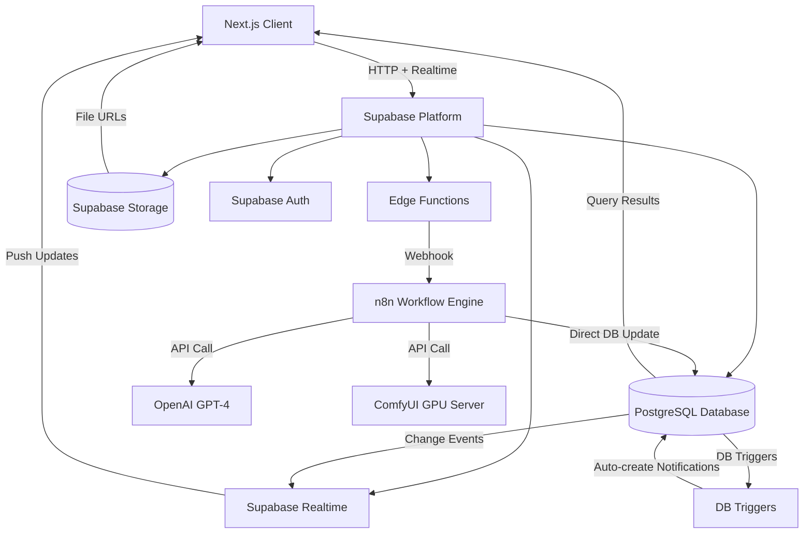

# XiCON 백엔드 아키텍처 개요

> XiCON 백엔드 시스템 아키텍처, 데이터 흐름, 구현 구조에 대한 고수준 개요

## 시스템 아키텍처

XiCON 백엔드는 Supabase를 핵심 플랫폼으로 하며, 외부 서비스가 AI 생성 워크플로우를 처리합니다. 시스템은 비동기 이벤트 기반 아키텍처를 따릅니다.



### 아키텍처 레이어

1. **클라이언트 레이어 (Next.js)**
   - 모든 백엔드 상호작용을 위한 Supabase Client SDK
   - 실시간 상태 업데이트를 위한 Realtime 구독
   - CRUD 작업을 위한 직접 REST API 호출

2. **API 게이트웨이 레이어 (Supabase Edge Functions)**
   - 클라이언트로부터 생성 요청 수신
   - 크레딧 잔액 및 권한 검증
   - AI 처리를 위한 n8n 웹훅 트리거
   - `generation_jobs` 큐에 작업 추가

3. **워크플로우 오케스트레이션 레이어 (n8n)**
   - AI 생성 워크플로우 관리
   - GPT-4와 ComfyUI 간 조율
   - 파일 업로드 및 다운로드 처리
   - Supabase 데이터베이스에 직접 연결하여 작업 상태 업데이트

4. **AI 서비스 레이어**
   - **OpenAI GPT-4**: 텍스트 생성 (브랜딩 리포트, 마케팅 문구)
   - **ComfyUI**: 이미지 및 영상 생성 (Stable Diffusion, AnimateDiff, SVD)

5. **데이터 레이어 (Supabase)**
   - **PostgreSQL Database**: RLS가 적용된 모든 구조화된 데이터
   - **Storage**: 접근 제어가 있는 파일 저장소
   - **Auth**: 사용자 인증 및 세션 관리
   - **Realtime**: 장시간 실행 작업을 위한 실시간 업데이트
   - **Database Triggers**: 이벤트 기반 자동 알림 생성 (generation_jobs INSERT, works UPDATE, credit_transactions INSERT)

---

## 기술 스택

| 구성 요소           | 기술                    | 용도                                                                       |
| ------------------- | ----------------------- | -------------------------------------------------------------------------- |
| **인증**            | Supabase Auth           | Google OAuth 소셜 로그인 (MVP), 세션 관리                                  |
| **데이터베이스**    | PostgreSQL (Supabase)   | Row Level Security가 적용된 모든 구조화된 데이터 저장소                    |
| **파일 저장소**     | Supabase Storage        | 사용자 업로드 파일, 생성된 컨텐츠 (PDF, 이미지, 영상)                      |
| **API 게이트웨이**  | Supabase Edge Functions | 생성 요청 처리 (`generate` 함수만 구현, n8n 웹훅은 DB 트리거 사용)         |
| **실시간 업데이트** | Supabase Realtime       | 컨텐츠 생성에 대한 실시간 상태 알림                                        |
| **워크플로우 엔진** | n8n (Self-hosted)       | AI 생성 워크플로우 오케스트레이션                                          |
| **텍스트 AI**       | OpenAI GPT-4            | 브랜딩 리포트, 마케팅 문구 생성                                            |
| **이미지/영상 AI**  | ComfyUI                 | Stable Diffusion 기반 이미지 및 영상 생성                                  |
| **결제**            | 토스페이먼츠 / 포트원   | 구독 및 크레딧 구매 처리                                                   |

### 이 스택을 선택한 이유

- **Supabase**: 최소한의 설정으로 완전한 백엔드 인프라 제공 (인증, 데이터베이스, 저장소, 실시간)
- **n8n**: 복잡한 오케스트레이션 코드 작성 없이 유연한 워크플로우 자동화
- **ComfyUI**: 템플릿 지원이 있는 오픈소스 커스터마이징 가능한 이미지/영상 생성
- **Edge Functions**: 데이터베이스에 가까운 서버리스 함수로 낮은 지연시간

---

## 핵심 도메인 엔티티

### 사용자 관리

- **Users**: 프로필 정보, 크레딧 잔액 (구독 + 구매), 온보딩 상태
- **Projects**: 컨텐츠 조직 단위 - 모든 생성물은 프로젝트에 속함
- **Subscriptions**: 청구 주기가 있는 활성 구독 플랜
- **Credit Transactions**: 크레딧 사용, 구매, 환불 내역

### 컨텐츠 생성

- **Works**: 모든 생성 컨텐츠 타입을 통합한 엔티티
  - 타입: `branding_report`, `marketing_copy`, `promotional_image`, `video_content`
  - 상태: `pending` → `processing` → `completed` / `failed`
  - 입력 데이터, AI 생성 메타데이터 (프롬프트, 모델 설정, 처리 시간 등), 파일 참조 포함
  - **1:1 파일 관계**: 각 work는 정확히 1개의 출력 파일 (`file_id`)을 가짐
  - **배치 그룹화**: 같은 생성 요청으로 여러 work 생성 시 `batch_id`로 그룹화
    - 예: 사용자가 "출력 4장" 선택 → 4개의 independent work 생성, 같은 batch_id 공유
    - 각 work는 독립적으로 공개/비공개 설정, 삭제, 피드백 가능
  - **검색 지원**: `title` (제목)과 `tags` (태그 배열)로 검색 가능
  - **RunPod 통합**: `runpod_job_id`로 RunPod 서버리스 GPU 작업 추적
  - **크레딧 출처 추적**: `subscription_credits_used`, `purchased_credits_used`로 환불 시 원래 출처로 정확히 환불
  - `like_count`, `favorite_count` (비정규화 카운트)
- **Files**: 모든 Storage 파일의 메타데이터 중앙 관리
  - 버킷별 파일 추적 (works, uploads, avatars, templates 등)
  - 파일 크기, 타입, 이미지 치수, 영상 길이 등 메타데이터 저장
  - 프론트엔드 표시용 정보 제공, Storage 할당량 관리
  - Soft delete로 정리 작업 지원
- **Generation Jobs**: 비동기 컨텐츠 생성 작업 큐 (PostgreSQL 기반)
  - 상태: `pending` → `taken`
  - 1 work : N jobs 관계 (실패 시 재시도를 위한 새 job 생성)
  - 우선순위 지원
  - Fire & Forget 패턴: 요청 즉시 처리, 실제 작업은 비동기로 진행
- **Templates**: 이미지/영상 생성을 위한 사전 구성된 ComfyUI 워크플로우
  - `work_type`: 생성물 타입 (`promotional_image`, `video_content`)
  - `title`: 템플릿 표시 제목
  - `template_name`: AI 생성 워커 서버 식별자
  - `estimated_time`: 예상 생성 시간 (초) - UI 진행 표시용
  - `output_file_id`: 샘플 파일 참조 - 인터랙티브 미리보기용 (예: 호버 시 영상 재생)
  - `form_fields`: 동적 폼 필드 정의 (JSONB, 필수)
  - `request_dto`: API 요청 input_data 타입 정의 (JSONB, 필수)
  - 워크플로우 JSON, 미리보기 이미지 포함
- **Branding Reports**: 마케팅 문구/이미지/영상 생성에 사용되는 참조 문서
  - 6개 AI 에이전트 체인으로 생성: Market Research → JTBD → Benefit Ladder → CEP → RTB → SMP
  - 사용자가 3단계 폼(브랜드 정보 → USP → 마케팅 목표) 작성으로 생성
  - `works` 테이블의 `branding_report_id` 외래키로 참조
  - PDF 형식으로 생성하여 Supabase Storage에 업로드
  - 완료 후 다른 생성물(marketing_copy, promotional_image, video_content)의 컨텍스트로 사용

### 소셜 기능

- **Likes**: 공개 생성물에 대한 좋아요 (비정규화 좋아요 수 자동 집계)
- **Favorite Works** (`user_favorite_works`): 모든 사용자(소유자 포함)가 생성물을 즐겨찾기에 저장 (비정규화 즐겨찾기 수 자동 집계)
  - 소유자가 자신의 생성물 즐겨찾기 가능
  - 다른 사용자가 공개 생성물 즐겨찾기 가능
  - Trigger로 `works.favorite_count` 자동 업데이트
- **Feedbacks**: 생성된 컨텐츠에 대한 만족도 피드백 (좋아요/싫어요)
- **Gallery**: 모든 사용자에게 보이는 공개 생성물 (`is_public = true`로 필터링)

### 비즈니스 모델

- **Subscription Plans**: 크레딧 할당이 있는 월간/연간 플랜
- **Credit Packages**: 일회성 크레딧 구매
- **Payment Methods**: 정기 결제를 위한 저장된 빌링키
- **Payment History**: 모든 결제에 대한 거래 기록

### 시스템 기능

- **Notifications**: 생성 상태, 구독 업데이트에 대한 사용자 알림
- **Banners**: 앱에 표시되는 프로모션 배너
- **Partners**: 랜딩 페이지에 표시되는 파트너/광고 배너
- **FAQs**: 자주 묻는 질문

### Admin 관리 기능

Admin 대시보드를 통해 서비스 전반을 관리합니다:

- **사용자 관리**: 사용자 목록 조회, 상세 정보, 크레딧 수동 조정
- **생성물 관리**: 공개/비공개 전환, 삭제, 작업 재시도/실패 처리
- **템플릿 관리**: 생성 템플릿 CRUD, 활성화/비활성화, 순서 변경
- **콘텐츠 관리**: 배너, 파트너(광고), FAQ 관리
- **결제 관리**: 구독 요금제, 크레딧 상품 설정
- **알림 발송**: 타겟 그룹별 알림 발송 (전체, 구독자, 미구독자 등)

> 상세 API 명세: [admin-supabase-api.md](./admin-supabase-api.md)

---

## 주요 데이터 흐름

### 1. 인증 흐름

```
사용자가 "Google 로그인" 클릭
  ↓
Supabase Auth가 Google OAuth로 리다이렉트
  ↓
사용자가 Google에서 승인
  ↓
Google이 Supabase로 리다이렉트
  ↓
데이터베이스 트리거: 사용자 레코드 + 첫 프로젝트 자동 생성
  ↓
클라이언트가 인증 세션 수신
  ↓
온보딩 흐름 (첫 방문인 경우)
```

**핵심 포인트:**

- 신규 사용자는 자동으로 프로필 레코드와 기본 프로젝트를 받음
- 온보딩은 완료 상태와 현재 단계를 추적
- 이후 모든 요청은 JWT 세션 토큰 사용

### 2. 컨텐츠 생성 흐름 (Fire & Forget 패턴)

```
클라이언트: 사용자가 생성 요청 제출
  ↓
Edge Function: 크레딧 검증 및 **선차감**, work 레코드 생성 (상태: pending)
  ↓
Edge Function: generation_jobs에 작업 INSERT (상태: pending)
  ↓
Edge Function: 클라이언트에 즉시 응답 (work_id, status=pending)
  ↓
[비동기 처리 - 클라이언트가 기다리지 않음]
  ↓
n8n: 폴링 또는 DB Webhook으로 pending 작업 감지
  ↓
n8n: generation_jobs UPDATE (상태: taken)
  ↓
n8n: work 타입에 따라 GPT-4 또는 ComfyUI 호출
  ↓
n8n: AI 응답 처리, 파일 생성
  ↓
n8n: Supabase Storage에 파일 업로드
  ↓
n8n: 결과와 함께 Edge Function 콜백 호출
  ↓
Edge Function: work 레코드 업데이트 (상태: completed, file_url)
  ↓
Edge Function: generation_jobs DELETE (작업 완료)
  ↓
Realtime: 클라이언트에 상태 업데이트 브로드캐스트
  ↓
클라이언트: 알림 수신, UI 새로고침
```

**핵심 포인트:**

- 모든 생성은 비동기 (Fire & Forget): Edge Function은 job INSERT 후 즉시 응답
- work 레코드와 generation_jobs가 함께 생성됨
- 크레딧은 생성 시작 시점에 즉시 차감되며, 실패 시에만 환불됨
- Realtime 알림이 UI를 동기화 상태로 유지
- n8n이 generation_jobs를 폴링 또는 DB Webhook으로 감지하여 처리

### 3. 크레딧 차감 및 환불 흐름

```
사용자가 생성 시작
  ↓
Edge Function: 총 크레딧 잔액 확인 및 충분성 검증
  ↓
Edge Function: 크레딧 선차감 실행
  - subscription_credits에서 먼저 차감
  - 부족하면 purchased_credits에서 차감
  ↓
Edge Function: work 레코드 생성
  - credits_used = 총 차감액
  - subscription_credits_used = 정기 크레딧 차감액
  - purchased_credits_used = 충전 크레딧 차감액
  ↓
Edge Function: credit_transactions 레코드 생성 (type = usage)
  ↓
[생성 프로세스 진행]
  ↓
성공 시:
  - work 상태 = completed
  - 추가 크레딧 작업 없음 (이미 차감됨)
  ↓
실패 시 (n8n이 works.status = 'failed'로 직접 업데이트):
  - work 상태 = failed
  - DB 트리거 `trg_refund_credits_on_failure` 자동 실행:
    - subscription_credits_used 만큼 subscription_credits에 환불
    - purchased_credits_used 만큼 purchased_credits에 환불
    - credit_transactions 레코드 생성 (type = refund, 출처 명시)
  - DB 트리거 `trg_notify_work_status_change` 자동 실행:
    - 실패 알림 생성 (환불된 크레딧 수량 포함)
```

**핵심 포인트:**

- 생성 시작 시점에 크레딧을 미리 확보하여 중복 생성 및 어뷰징 방지
- 실제 차감은 구독 크레딧 우선, 그 다음 구매 크레딧 순서
- 실패한 생성(시스템 오류, 타임아웃 등)에 대해서는 반드시 환불 처리
- **환불 시 원래 출처로 정확히 환불** (구독 크레딧 → 구독 크레딧, 충전 크레딧 → 충전 크레딧)
- 모든 차감과 환불은 `credit_transactions`에 기록되어 추적 가능함

### 4. 갤러리 흐름

```
사용자가 컨텐츠 생성 (기본값: is_public = false)
  ↓
사용자가 work 상세 모달 열기
  ↓
사용자가 "공개하기" 토글 클릭
  ↓
클라이언트: PATCH /rest/v1/works (is_public = true)
  ↓
데이터베이스: RLS가 업데이트 허용 (사용자가 work 소유)
  ↓
공개 갤러리 쿼리에 work 표시
  ↓
다른 사용자가 조회, 좋아요(likes), 피드백, 바로 만들기, 즐겨찾기 추가(user_favorite_works) 가능
```

**핵심 포인트:**

- 모든 컨텐츠는 기본적으로 비공개
- 사용자가 명시적으로 공개 옵트인
- 공개 work는 좋아요 수와 함께 갤러리에 표시
- 즐겨찾기 및 좋아요는 사용자별로 독립적인 관계 테이블로 관리됨
- Storage RLS가 공개 work의 파일에 대한 공개 접근 허용

### 5. 브랜딩 리포트 생성 흐름

```
사용자가 3단계 폼 작성 (브랜드 정보 → USP → 마케팅 목표)
  ↓
Edge Function: 크레딧 검증 및 선차감
  ↓
Edge Function: works + generation_jobs INSERT (type = branding_report)
  ↓
Database Trigger: `generation_jobs` INSERT 감지 → n8n webhook 자동 호출
  ↓
n8n: 6개 AI 에이전트 순차 실행
  ├─ 1. Market Research (Perplexity): 시장 조사 및 경쟁사 분석
  ├─ 2. JTBD (OpenAI GPT-4): 고객의 직무를 하기 위한 필요성 정의
  ├─ 3. Benefit Ladder (OpenAI GPT-4): 기능 → 이점 → 가치 계층 구조
  ├─ 4. CEP (OpenAI GPT-4): 고객 경험 지점 매핑
  ├─ 5. RTB (OpenAI GPT-4): 이성적, 감정적, 지성적 이득 도출
  └─ 6. SMP (OpenAI GPT-4): 전략적 마케팅 포지셔닝
  ↓
n8n: 6개 결과를 종합하여 PDF 리포트 생성
  ↓
n8n: PDF를 Supabase Storage (works/{user_id}/{work_id}/output.pdf)에 업로드
  ↓
n8n: works 레코드 직접 UPDATE (status = completed, file_id 설정)
  ↓
Database Trigger: `trg_notify_work_status_change` 자동 실행
  ├─ 완료 알림 생성 (notifications 테이블 INSERT)
  ├─ files 테이블에 파일 메타데이터 저장
  └─ 이후 생성 (marketing_copy, promotional_image, video_content)에 branding_report_id 참조 가능
  ↓
Realtime: 클라이언트에 상태 업데이트 (status = completed, file_url)
  ↓
클라이언트: 알림 수신, UI 새로고침, 리포트 다운로드 버튼 활성화
```

**핵심 포인트:**

- 브랜딩 리포트는 **순차적 6단계 AI 에이전트 체인**으로 생성 (각 단계가 이전 결과에 의존)
- 사용자가 3단계 폼 정보만 입력하면 나머지는 자동 처리
- 크레딧은 생성 시작 시점에 선차감되며, 실패 시에만 환불
- Database Webhook Trigger가 n8n 호출을 자동화 (n8n 폴링 불필요)
- PDF 생성은 n8n에서 처리하며, 완료 후 다른 생성물의 컨텍스트로 사용
- 모든 상태 변화는 Realtime으로 클라이언트에 즉시 전달
- 브랜딩 리포트 생성 실패 시 타 생성물은 이를 감지하고 적절히 처리해야 함

---

## 저장소 구성

### 버킷 구조

**접근 제어 방식**: 모든 버킷은 기술적으로 **Public**으로 설정되어 있으며, 실제 접근 제어는 **Storage RLS 정책**을 통해 이루어집니다.

| 버킷        | 용도                                        | 파일 크기 | 허용 MIME 타입                                                | RLS 정책 기반 접근 제어                     |
| ----------- | ------------------------------------------- | --------- | ------------------------------------------------------------- | ------------------------------------------- |
| `avatars`   | 사용자 프로필 이미지                        | 5MB       | image/jpeg, image/png, image/gif, image/webp                  | 공개 읽기, 소유자 쓰기                      |
| `uploads`   | 사용자 업로드 파일 (제품 이미지, 참고 자료) | 50MB      | image/jpeg, image/png, image/gif, image/webp, application/pdf | 비공개 (소유자만)                           |
| `works`     | 생성된 컨텐츠 (PDF, 이미지, 영상)           | 100MB     | image/*, video/mp4, video/webm, application/pdf               | 기본 비공개, work.is_public = true이면 공개 |
| `templates` | 템플릿 미리보기 이미지/영상                 | 50MB      | image/*, video/mp4, video/webm                                | 공개 읽기                                   |
| `assets`    | 정적 자산 통합 (배너, 파트너 로고, 영상 등) | 200MB     | image/jpeg, image/png, image/gif, image/webp, image/svg+xml, video/mp4, video/webm | 공개 읽기 |

### 파일 경로 패턴

```
avatars/{user_id}/avatar.{ext}
uploads/{user_id}/{project_id}/{uuid}.{ext}
works/{user_id}/{work_id}/output.{ext}
works/{user_id}/{work_id}/thumbnail.{ext}
templates/{template_id}/preview.{ext}
assets/banners/{filename}.{ext}
assets/partners/{filename}.{ext}
assets/videos/{filename}.{ext}
assets/misc/{filename}.{ext}
```

### 접근 제어 원칙

- **기본 비공개**: 명시적으로 공개하지 않는 한 모든 사용자 컨텐츠는 비공개
- **소유자 접근**: 사용자는 항상 자신의 파일에 접근 가능
- **조건부 공개 접근**: `works.is_public = true`인 경우 works 버킷 파일 접근 가능
- **RLS 정책**: Storage RLS가 파일 경로와 work 메타데이터를 기반으로 접근 규칙 강제

---

## 보안 원칙

### 데이터 격리

- **Row Level Security (RLS)**: 모든 데이터베이스 테이블에 RLS 정책 적용
  - 사용자는 자신의 데이터에만 접근 가능
  - 공개 work는 모든 인증된 사용자가 접근 가능
  - 서비스 역할 키는 Edge Functions에서만 사용

### 인증 및 권한 부여

- **JWT 토큰**: 모든 API 요청이 Supabase JWT로 인증됨
- **Edge Functions**: 데이터베이스 작업에 서비스 역할 키 사용
- **웹훅 보안**: n8n 콜백이 비밀 토큰으로 인증됨

### 파일 접근 제어

- **Storage RLS**: 버킷 정책으로 파일 접근 제어
- **기본 비공개**: 명시적으로 공개하지 않는 한 모든 사용자 파일 비공개
- **경로 기반 접근**: Storage 정책이 파일 경로와 work 메타데이터 확인

### 크레딧 보안

- **서버 측 검증**: 크레딧 확인은 Edge Functions에서만 수행
- **원자적 트랜잭션**: 크레딧 차감이 데이터베이스 트랜잭션 사용
- **감사 추적**: 모든 크레딧 거래가 책임 추적을 위해 기록됨

---

## 주요 아키텍처 결정 사항

### 비동기 생성

**이유**: AI 생성은 수초에서 수분이 걸릴 수 있음. 동기 요청은 타임아웃될 것임.

**방법**:

- 클라이언트가 즉시 work 레코드 생성
- Edge Function이 n8n 웹훅 트리거
- n8n이 비동기 처리
- 콜백이 work 상태 업데이트
- Realtime이 클라이언트에 알림

### 오케스트레이션 레이어로서의 n8n

**이유**: Edge Functions에서 복잡한 워크플로우 코드 작성 회피. 시각적 워크플로우 에디터로 AI 파이프라인 수정이 더 쉬움.

**방법**:

- Edge Functions는 요청/응답만 처리
- n8n이 모든 AI 서비스 호출 관리
- n8n이 재시도, 오류 처리, 파일 작업 처리

**n8n 브랜딩 리포트 워크플로우**:

- 6개 AI 에이전트를 **순차 실행** (각 단계가 이전 결과에 의존)
  - 예: JTBD는 Market Research 결과를 입력으로 사용
  - 예: Benefit Ladder는 JTBD 결과 기반으로 이점 도출
- 각 에이전트는 특정 마케팅 프레임워크 전담
- 최종 결과를 PDF로 종합하여 Storage 업로드
- n8n이 works 상태 직접 UPDATE (status = completed)
- 순차 실행이 필수인 이유: 컨텍스트 의존성 때문에 병렬화 불가능

### 통합 Works 테이블

**이유**: 모든 컨텐츠 타입이 유사한 속성 공유 (상태, 파일, 크레딧). 단일 테이블이 쿼리를 단순화하고 복잡성 감소.

**방법**:

- `works.type` 필드가 컨텐츠 타입 구분
- `works.input_data`가 타입별 입력 저장
- `works.output_data`가 타입별 출력 메타데이터 저장

### 크레딧 풀 시스템

**이유**: 구독 크레딧은 월별로 리셋되고, 구매 크레딧은 영구적임. 두 풀은 유연한 비즈니스 모델 허용.

**방법**:

- `users.subscription_credits`: 월별 할당, 미사용 시 만료
- `users.purchased_credits`: 영구 잔액
- 차감 로직이 구독 크레딧 우선

### Job Queue 기반 비동기 처리

**이유**: 대량의 생성 요청을 처리할 때 Edge Function이 n8n을 직접 호출하면 워커 부족, 타임아웃 등 문제 발생. 데이터베이스 기반 큐로 요청을 버퍼링하고 워커가 자신의 속도로 소비.

**방법 (MVP - Supabase PostgreSQL 기반)**:

- `generation_jobs` 테이블로 작업 큐 구현
  - 상태: `pending` → `taken`
  - 1 work : N jobs 관계 (실패 시 새 job 생성으로 재시도)
  - `priority` 필드로 우선순위 지원
- Edge Function: 요청 받으면 job INSERT + 즉시 응답 (Fire & Forget)
- **Database Webhook Trigger (Broadcast 패턴)**: PostgreSQL 트리거가 `generation_jobs` INSERT 시 자동으로 n8n 웹훅 호출
  - `supabase_functions.http_request()`로 n8n에 POST 요청
  - **모든 트리거가 모든 INSERT에 발동** (타입 필터링 없음)
  - 각 n8n workflow가 `WHERE w.type = '자기타입'`으로 필터링
  - 이 설계는 확장성, 장애 격리, 배포 독립성을 위해 선택됨 (상세: DB_RELATIONSHIPS.md ADR-2026-02-04)

**향후 확장 (트래픽 증가 시)**:

- Redis Queue로 전환 (순수 메모리 기반, 더 빠름)
- n8n Queue Mode와 다중 워커 구성
- ComfyUI Auto-scaling (RunPod, Lambda 등)

**장점**:

- 최소한의 인프라로 시작 (Supabase만 필요)
- PostgreSQL의 ACID 트랜잭션으로 안정성 보장
- 실패 복구 메커니즘 자동 제공
- 데이터베이스 상태로 디버깅 용이

---

## 관련 문서

- **[브랜딩 리포트 파이프라인](./BRANDING_REPORT_PIPELINE.md)** - 브랜딩 리포트 생성 파이프라인 상세 명세 및 n8n 워크플로우
- **[데이터베이스 관계 설명](./DB_RELATIONSHIPS.md)** - 테이블 간 관계, 외래키, 참조 무결성 세부사항
