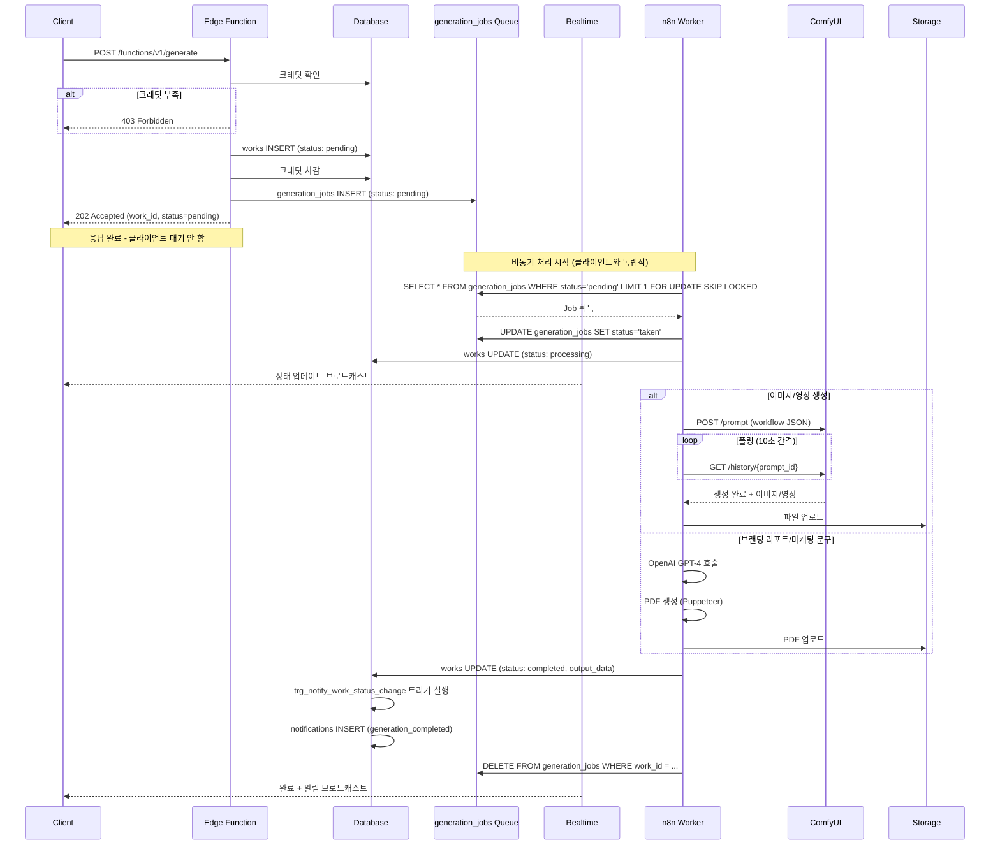

# XiCON Supabase API 계획서

---

## 1. 개요

### 1.1 기술 스택

| 기술                               | 용도                              |
| ---------------------------------- | --------------------------------- |
| **Supabase Auth**                  | Google 소셜 로그인 (MVP)          |
| **Supabase Database (PostgreSQL)** | 데이터 저장                       |
| **Supabase Storage**               | 파일 업로드 (이미지, PDF, 영상)   |
| **Supabase Edge Functions**        | AI 생성 로직 연동, 결제 웹훅 처리 |
| **Supabase Realtime**              | 생성 상태 실시간 알림             |
| **Row Level Security (RLS)**       | 데이터 접근 제어                  |

### 1.2 외부 서비스 연동

| 서비스                  | 용도                                   | 비고                    |
| ----------------------- | -------------------------------------- | ----------------------- |
| **n8n (Self-hosted)**   | AI 생성 작업 오케스트레이션            | Webhook 기반 워크플로우 |
| **ComfyUI**             | Stable Diffusion 기반 이미지/영상 생성 | GPU 서버 필요           |
| **OpenAI GPT-4**        | 브랜딩 리포트, 마케팅 문구 생성        | n8n에서 호출            |
| **토스페이먼츠/포트원** | 결제 처리                              | 빌링키 기반 정기결제    |

### 1.3 시스템 아키텍처 다이어그램

```
┌──────────────────────────────────────────────────────┐
│              Client (Next.js Frontend)               │
│  - Supabase Client SDK                               │
│  - Realtime 구독                                     │
└───────────────────┬──────────────────────────────────┘
                    │ HTTP + Realtime
                    ▼
┌──────────────────────────────────────────────────────┐
│                    Supabase                          │
│  ┌────────────────────────────────────────────────┐  │
│  │ Auth (Google OAuth)                            │  │
│  │ Database (PostgreSQL) + RLS                    │  │
│  │ Storage (파일 저장)                            │  │
│  │ Realtime (상태 업데이트 브로드캐스트)          │  │
│  │ Edge Functions (API 게이트웨이)                │  │
│  └────────────────────────────────────────────────┘  │
└───────────────────┬──────────────────────────────────┘
                    │ Webhook 호출
                    ▼
┌──────────────────────────────────────────────────────┐
│              n8n Workflow Engine                     │
│                                                      │
│  Workflow 1: 브랜딩 리포트 생성                      │
│    ├─ OpenAI GPT-4 호출                             │
│    ├─ PDF 생성                                      │
│    └─ Supabase 콜백                                 │
│                                                      │
│  Workflow 2: 마케팅 문구 생성                        │
│    ├─ OpenAI GPT-4 호출                             │
│    └─ Supabase 콜백                                 │
│                                                      │
│  Workflow 3: 이미지 생성                             │
│    ├─ ComfyUI API 호출                              │
│    ├─ 결과 이미지 다운로드                          │
│    ├─ Storage 업로드                                │
│    └─ Supabase 콜백                                 │
│                                                      │
│  Workflow 4: 영상 생성                               │
│    ├─ ComfyUI API 호출 (AnimateDiff/SVD)            │
│    ├─ 결과 영상 다운로드                            │
│    ├─ Storage 업로드                                │
│    └─ Supabase 콜백                                 │
└───────────────────┬──────────────────────────────────┘
                    │ HTTP API
                    ▼
┌──────────────────────────────────────────────────────┐
│                    ComfyUI                           │
│  - Stable Diffusion 이미지 생성                      │
│  - AnimateDiff/SVD 영상 생성                        │
│  - 템플릿 기반 워크플로우                            │
│  - GPU 서버 (NVIDIA)                                │
└──────────────────────────────────────────────────────┘
```

---

## 2. 데이터베이스 스키마

### 2.1 테이블 상세 정의

#### 2.1.1 `users` (사용자)

사용자 프로필 및 크레딧 정보를 저장합니다. `auth.users`와 1:1 관계입니다.

| 컬럼                   | 타입        | 필수 | 기본값 | 설명                                                         |
| ---------------------- | ----------- | ---- | ------ | ------------------------------------------------------------ |
| `id`                   | uuid        | O    | -      | PK, auth.users.id 참조                                       |
| `email`                | text        | O    | -      | 이메일 (소셜 로그인에서 가져옴)                              |
| `nickname`             | text        | O    | -      | Unique, 닉네임 (소셜 로그인의 full_name을 기본값으로 사용함) |
| `avatar_url`           | text        | -    | null   | 프로필 이미지 URL (소셜 로그인에서 제공되지 않으면 null)     |
| `provider`             | text        | -    | null   | 소셜 로그인 Provider (MVP: google, 추후: kakao)              |
| `provider_account_id`  | text        | -    | null   | Provider 계정 고유 ID                                        |
| `role`                 | text        | -    | null   | 사용 목적(역할) (온보딩 단계에서 설정)                       |
| `subscription_credits` | int         | O    | 0      | 정기 크레딧 잔액                                             |
| `purchased_credits`    | int         | O    | 0      | 충전 크레딧 잔액                                             |
| `onboarding_completed` | bool        | O    | false  | 온보딩 완료 여부                                             |
| `onboarding_step`      | int         | O    | 1      | 현재 온보딩 단계 (이탈 후 재진입 시 사용)                    |
| `email_consent`        | bool        | O    | false  | 이메일 수신 동의                                             |
| `sms_consent`          | bool        | O    | false  | SMS 수신 동의                                                |
| `created_at`           | timestamptz | O    | now()  | 가입일                                                       |
| `updated_at`           | timestamptz | O    | now()  | 수정일                                                       |

---

#### 2.1.2 `projects` (프로젝트)

사용자의 프로젝트를 관리합니다. 모든 생성물은 프로젝트에 소속됩니다.

| 컬럼               | 타입        | 필수 | 기본값            | 설명             |
| ------------------ | ----------- | ---- | ----------------- | ---------------- |
| `id`               | uuid        | O    | gen_random_uuid() | PK               |
| `user_id`          | uuid        | O    | -                 | FK → users.id    |
| `name`             | text        | O    | -                 | 프로젝트명       |
| `last_accessed_at` | timestamptz | O    | now()             | 마지막 접근 시간 |
| `created_at`       | timestamptz | O    | now()             | 생성일           |
| `deleted_at`       | timestamptz | -    | null              | 소프트 삭제 시간 |

---

#### 2.1.3 `works` (생성물)

모든 종류의 생성물(브랜딩 리포트, 마케팅 문구, 홍보 이미지, 영상 컨텐츠)을 통합 관리합니다.

| 컬럼                          | 타입        | 필수 | 기본값            | 설명                                                                                            |
| ----------------------------- | ----------- | ---- | ----------------- | ----------------------------------------------------------------------------------------------- |
| `id`                          | uuid        | O    | gen_random_uuid() | PK                                                                                              |
| `project_id`                  | uuid        | O    | -                 | FK → projects.id                                                                                |
| `user_id`                     | uuid        | O    | -                 | FK → users.id (비정규화, 갤러리 쿼리 최적화)                                                    |
| `template_id`                 | uuid        | -    | null              | FK → templates.id (이미지/영상만)                                                               |
| `branding_report_id`          | uuid        | -    | null              | FK → works.id (문구/이미지/영상 생성 시 참조)                                                   |
| `batch_id`                    | uuid        | -    | null              | 배치 생성 그룹 ID (같은 요청에서 생성된 works 그룹)                                             |
| `type`                        | text        | O    | -                 | 생성물 타입                                                                                     |
| `title`                       | text        | -    | null              | 생성물 제목 (검색용)                                                                            |
| `tags`                        | text[]      | -    | '{}'              | 검색용 태그 배열                                                                                |
| `status`                      | text        | O    | 'pending'         | 생성 상태                                                                                       |
| `input_data`                  | jsonb       | O    | -                 | 생성 입력 데이터(첨부 파일 ID 포함)                                                             |
| `output_data`                 | jsonb       | -    | null              | AI 생성 메타데이터 (프롬프트, 모델 설정, 시드, 처리 시간, 토큰 사용량, 에러 메시지)             |
| `output_file_id`              | uuid        | -    | null              | FK → files.id (결과 파일, 1 work : 1 file 관계)                                                 |
| `thumbnail_file_id`           | uuid        | -    | null              | FK → files.id (썸네일 파일, 1 work : 1 file 관계)                                               |
| `is_public`                   | bool        | O    | false             | 공개 여부                                                                                       |
| `like_count`                  | int         | O    | 0                 | 좋아요 수 (비정규화)                                                                            |
| `favorite_count`              | int         | O    | 0                 | 즐겨찾기 수 (비정규화)                                                                          |
| `satisfaction`                | bool        | -    | null              | 소유자 만족도 피드백 (true=긍정, false=부정, null=미평가). **1회 설정 후 변경 불가(immutable)** |
| `credits_used`                | int         | O    | 0                 | 사용된 총 크레딧                                                                                |
| `subscription_credits_used`   | int         | O    | 0                 | 차감된 정기 크레딧 수량 (환불 시 원래 출처로 환불)                                              |
| `purchased_credits_used`      | int         | O    | 0                 | 차감된 충전 크레딧 수량 (환불 시 원래 출처로 환불)                                              |
| `created_at`                  | timestamptz | O    | now()             | 생성일                                                                                          |
| `deleted_at`                  | timestamptz | -    | null              | 휴지통 이동 시간                                                                                |
| `runpod_job_id`               | varchar     | -    | null              | RunPod 작업 ID (RunPod 서버리스 GPU 사용 시 추적용)                                             |
| `timeout_at`                  | timestamptz | -    | null              | 타임아웃 시점. pg_cron이 이 시간 이후 자동으로 실패 처리                                        |
| `idempotency_key`             | varchar     | -    | null              | 중복 요청 방지 키 (5분 이내 동일 키 요청 시 기존 work 반환)                                     |

**type 값:**

- `branding_report` - 브랜딩 리포트
- `marketing_copy` - 마케팅 문구
- `promotional_image` - 홍보 이미지
- `video_content` - 영상 컨텐츠

**status 값:**

- `pending` - 대기 중
- `processing` - 생성 중
- `completed` - 완료
- `failed` - 실패

---

#### 2.1.4 `generation_jobs` (생성 작업 큐)

비동기 컨텐츠 생성 작업을 관리하는 Fire & Forget 패턴의 작업 큐입니다. Edge Function은 작업을 INSERT하고 즉시 응답하며, n8n이 폴링 또는 DB Webhook으로 작업을 소비합니다.

**1 work : N jobs 관계**: work 생성 시 job이 함께 생성됩니다. 실패 시 재시도를 위해 새로운 job이 생성되므로, 하나의 work에 여러 job이 존재할 수 있습니다.

| 컬럼         | 타입        | 필수 | 기본값            | 설명                             |
| ------------ | ----------- | ---- | ----------------- | -------------------------------- |
| `id`         | uuid        | O    | gen_random_uuid() | PK                               |
| `work_id`    | uuid        | O    | -                 | FK → works.id (생성 결과 기록용) |
| `status`     | text        | O    | 'pending'         | 상태 (pending, taken)            |
| `priority`   | int         | O    | 0                 | 우선순위 (높을수록 먼저 처리)    |
| `created_at` | timestamptz | O    | now()             | 작업 생성 시간                   |

**status 값:**

- `pending` - 대기 중 (초기 상태)
- `taken` - 처리 중 (n8n이 작업 획득)

---

#### 2.1.5 `files` (파일 메타데이터)

모든 Storage 버킷의 파일 메타데이터를 중앙 관리합니다. 프론트엔드 표시용 정보, 할당량 관리, 정리 작업 지원을 위해 필요합니다.

| 컬럼         | 타입        | 필수 | 기본값            | 설명                                               |
| ------------ | ----------- | ---- | ----------------- | -------------------------------------------------- |
| `id`         | uuid        | O    | gen_random_uuid() | PK                                                 |
| `bucket_id`  | text        | O    | -                 | 버킷 이름 (works, uploads, avatars, templates, etc)  |
| `file_path`  | text        | O    | -                 | Storage 내 전체 경로                               |
| `file_name`  | text        | O    | -                 | 원본 파일명 (다운로드용)                           |
| `file_size`  | int         | O    | -                 | 파일 크기 (bytes)                                  |
| `file_type`  | text        | O    | -                 | MIME 타입 (image/jpeg, video/mp4, application/pdf) |
| `width`      | int         | -    | null              | 이미지/영상 너비 (px)                              |
| `height`     | int         | -    | null              | 이미지/영상 높이 (px)                              |
| `duration`   | int         | -    | null              | 영상 길이 (초)                                     |
| `user_id`    | uuid        | O    | -                 | FK → users.id (파일 소유자)                        |
| `work_id`    | uuid        | -    | null              | FK → works.id (생성물 파일인 경우)                 |
| `project_id` | uuid        | -    | null              | FK → projects.id (업로드 파일인 경우)              |
| `created_at` | timestamptz | O    | now()             | 업로드 시간                                        |
| `deleted_at` | timestamptz | -    | null              | Soft delete (정리 작업용)                          |
| `file_id`    | text        | O    | -                 | Unique (중복 방지용)                               |
| `file_url`   | text        | -    | null              | Storage 공개 URL (트리거로 자동 생성)              |

**file_url 자동 생성 트리거:**

`trg_generate_file_url` 트리거가 INSERT/UPDATE 시 `bucket_id`와 `file_path`를 기반으로 `file_url`을 자동 생성합니다.

**file_path 예시:**

```
works/user_123/work_456/output.jpg
works/user_123/work_456/thumbnail.jpg
uploads/user_123/project_789/product-image.png
avatars/user_123/avatar.jpg
```

---

#### 2.1.6 `templates` (템플릿)

홍보 이미지 및 영상 컨텐츠 생성에 사용되는 템플릿을 관리합니다.

| 컬럼                | 타입        | 필수 | 기본값            | 설명                                             |
| ------------------- | ----------- | ---- | ----------------- | ------------------------------------------------ |
| `id`                | uuid        | O    | gen_random_uuid() | PK                                               |
| `work_type`         | text        | O    | -                 | 생성물 타입 (promotional_image, video_content)   |
| `title`             | text        | O    | -                 | 템플릿 표시 제목                                 |
| `template_name`     | text        | O    | -                 | AI 생성 워커 서버 식별자                         |
| `description`       | text        | -    | null              | 템플릿 설명                                      |
| `thumbnail_file_id` | uuid        | -    | null              | FK → files.id (미리보기 이미지 또는 영상)        |
| `form_fields`       | jsonb       | O    | -                 | 동적 폼 필드 정의 (DynamicFieldConfig[])         |
| `request_dto`       | jsonb       | O    | -                 | API 요청 input_data 검증 스키마                  |
| `display_order`     | int         | O    | 0                 | 표시 순서                                        |
| `is_active`         | bool        | O    | true              | 활성화 여부                                      |
| `estimated_time`    | int         | O    | 60                | 예상 생성 시간 (초)                              |
| `output_file_id`    | uuid        | -    | null              | FK → files.id (샘플 파일, 인터랙티브 미리보기용) |
| `created_at`        | timestamptz | O    | now()             | 생성일                                           |

**`form_fields` 및 `request_dto` 상세:** [템플릿 설정값 명세서](./template-config-spec.md)

---

#### 2.1.7 `user_favorite_works` (즐겨찾기 생성물)

모든 사용자(소유자 포함)가 즐겨찾기한 생성물을 관리합니다. 소유자가 자신의 생성물에 즐겨찾기를 표시하거나, 다른 사용자가 공개 생성물에 즐겨찾기를 추가할 수 있습니다.

| 컬럼         | 타입        | 필수 | 기본값 | 설명          |
| ------------ | ----------- | ---- | ------ | ------------- |
| `user_id`    | uuid        | O    | -      | FK → users.id |
| `work_id`    | uuid        | O    | -      | FK → works.id |
| `created_at` | timestamptz | O    | now()  | 추가 시간     |

**자동 업데이트:** `favorite_count` 트리거가 INSERT/DELETE 시 `works.favorite_count` 자동 갱신

---

#### 2.1.8 `user_like_works` (좋아요)

타인의 공개 생성물에 대한 좋아요를 관리합니다.

| 컬럼         | 타입        | 필수 | 기본값            | 설명          |
| ------------ | ----------- | ---- | ----------------- | ------------- |
| `id`         | uuid        | O    | gen_random_uuid() | PK            |
| `user_id`    | uuid        | O    | -                 | FK → users.id |
| `work_id`    | uuid        | O    | -                 | FK → works.id |
| `created_at` | timestamptz | O    | now()             | 좋아요 시간   |

---

#### 2.1.9 `subscription_plans` (구독 요금제)

구독 요금제 정보를 관리합니다.

| 컬럼              | 타입        | 필수 | 기본값            | 설명                              |
| ----------------- | ----------- | ---- | ----------------- | --------------------------------- |
| `id`              | uuid        | O    | gen_random_uuid() | PK                                |
| `name`            | text        | O    | -                 | 요금제명 (Free, Pro, Business 등) |
| `description`     | text        | -    | null              | 요금제 설명                       |
| `monthly_price`   | int         | O    | 0                 | 월간 가격 (원)                    |
| `yearly_price`    | int         | O    | 0                 | 연간 가격 (원)                    |
| `monthly_credits` | int         | O    | 0                 | 월 제공 크레딧                    |
| `features`        | jsonb       | O    | '[]'              | 기능 목록                         |
| `display_order`   | int         | O    | 0                 | 표시 순서                         |
| `is_active`       | bool        | O    | true              | 판매 중 여부                      |
| `created_at`      | timestamptz | O    | now()             | 생성일                            |

---

#### 2.1.10 `subscriptions` (사용자 구독)

사용자의 구독 상태를 관리합니다.

| 컬럼              | 타입        | 필수 | 기본값            | 설명                              |
| ----------------- | ----------- | ---- | ----------------- | --------------------------------- |
| `id`              | uuid        | O    | gen_random_uuid() | PK                                |
| `user_id`         | uuid        | O    | -                 | FK → users.id                     |
| `plan_id`         | uuid        | O    | -                 | FK → subscription_plans.id        |
| `billing_cycle`   | text        | O    | -                 | 결제 주기 (monthly, yearly)       |
| `status`          | text        | O    | 'active'          | 상태 (active, cancelled, expired) |
| `started_at`      | timestamptz | O    | now()             | 구독 시작일                       |
| `expires_at`      | timestamptz | O    | -                 | 만료일                            |
| `next_billing_at` | timestamptz | -    | null              | 다음 결제일                       |
| `cancelled_at`    | timestamptz | -    | null              | 취소일                            |

---

#### 2.1.11 `credit_packages` (크레딧 상품)

개별 구매 가능한 크레딧 상품을 관리합니다.

| 컬럼             | 타입 | 필수 | 기본값            | 설명                                          |
| ---------------- | ---- | ---- | ----------------- | --------------------------------------------- |
| `id`             | uuid | O    | gen_random_uuid() | PK                                            |
| `name`           | text | O    | -                 | 상품명                                        |
| `credits`        | int  | O    | -                 | 총 크레딧 수량 (base_credits + bonus_credits) |
| `price`          | int  | O    | -                 | 가격 (원)                                     |
| `base_credits`   | int  | O    | 0                 | 기본 크레딧 수량                              |
| `bonus_credits`  | int  | O    | 0                 | 보너스 크레딧 수량                            |
| `bonus_percent`  | int  | O    | 0                 | 보너스 비율 (%)                               |
| `display_order`  | int  | O    | 0                 | 표시 순서                                     |
| `is_active`      | bool | O    | true              | 판매 중 여부                                  |

---

#### 2.1.12 `credit_transactions` (크레딧 내역)

크레딧 충전 및 사용 내역을 관리합니다.

| 컬럼            | 타입        | 필수 | 기본값            | 설명                    |
| --------------- | ----------- | ---- | ----------------- | ----------------------- |
| `id`            | uuid        | O    | gen_random_uuid() | PK                      |
| `user_id`       | uuid        | O    | -                 | FK → users.id           |
| `amount`        | int         | O    | -                 | 변동량 (+충전, -사용)   |
| `type`          | text        | O    | -                 | 타입                    |
| `description`   | text        | O    | -                 | 상세 설명               |
| `work_id`       | uuid        | -    | null              | FK → works.id (사용 시) |
| `balance_after` | int         | O    | -                 | 변동 후 총 잔액         |
| `created_at`    | timestamptz | O    | now()             | 거래 시간               |

**type 값:**

- `subscription` - 구독 크레딧 지급
- `purchase` - 크레딧 구매
- `usage` - 크레딧 사용
- `refund` - 환불

---

#### 2.1.13 `payment_methods` (결제 수단)

사용자의 결제 수단을 관리합니다.

| 컬럼          | 타입        | 필수 | 기본값            | 설명                            |
| ------------- | ----------- | ---- | ----------------- | ------------------------------- |
| `id`          | uuid        | O    | gen_random_uuid() | PK                              |
| `user_id`     | uuid        | O    | -                 | FK → users.id                   |
| `type`        | text        | O    | 'card'            | 결제 수단 타입                  |
| `card_last4`  | text        | O    | -                 | 카드 마지막 4자리               |
| `card_brand`  | text        | O    | -                 | 카드사 (visa, mastercard, etc.) |
| `billing_key` | text        | O    | -                 | PG사 빌링키 (암호화 저장)       |
| `is_default`  | bool        | O    | false             | 기본 결제 수단 여부             |
| `created_at`  | timestamptz | O    | now()             | 등록일                          |

---

#### 2.1.14 `payment_history` (결제 내역)

결제 내역을 관리합니다.

| 컬럼                | 타입        | 필수 | 기본값            | 설명                                        |
| ------------------- | ----------- | ---- | ----------------- | ------------------------------------------- |
| `id`                | uuid        | O    | gen_random_uuid() | PK                                          |
| `user_id`           | uuid        | O    | -                 | FK → users.id                               |
| `amount`            | int         | O    | -                 | 결제 금액 (원)                              |
| `product_type`      | text        | O    | -                 | 상품 타입 (subscription, credit)            |
| `product_id`        | uuid        | O    | -                 | 상품 ID                                     |
| `payment_method_id` | uuid        | -    | null              | FK → payment_methods.id                     |
| `pg_transaction_id` | text        | -    | null              | PG사 거래 ID                                |
| `status`            | text        | O    | 'pending'         | 상태 (pending, completed, failed, refunded) |
| `receipt_url`       | text        | -    | null              | 영수증 URL                                  |
| `created_at`        | timestamptz | O    | now()             | 결제 시간                                   |

---

#### 2.1.15 `notifications` (알림)

사용자 알림을 관리합니다.

| 컬럼         | 타입        | 필수 | 기본값            | 설명                     |
| ------------ | ----------- | ---- | ----------------- | ------------------------ |
| `id`         | uuid        | O    | gen_random_uuid() | PK                       |
| `user_id`    | uuid        | O    | -                 | FK → users.id            |
| `type`       | text        | O    | -                 | 알림 타입                |
| `title`      | text        | O    | -                 | 알림 제목                |
| `message`    | text        | O    | -                 | 알림 내용                |
| `data`       | jsonb       | -    | null              | 추가 데이터 (work_id 등) |
| `is_read`    | bool        | O    | false             | 읽음 여부                |
| `created_at` | timestamptz | O    | now()             | 생성일                   |

**type 값:**

**Generation Events (자동 트리거):**

- `generation_started` - 생성 대기 (generation_jobs INSERT 시, 즉시 피드백)
- `generation_completed` - 생성 완료 (works.status → 'completed' 시)
- `generation_failed` - 생성 실패 (works.status → 'failed' 시)

**Credit Events (자동 트리거):**

- `welcome_credits` - 웰컴 크레딧 지급 (신규 가입 시)
- `subscription_credits_refreshed` - 구독 크레딧 갱신 (월간 리셋 시)
- `credits_purchased` - 크레딧 구매 완료 (크레딧 구매 시)
- `credits_running_low` - 크레딧 부족 경고 (총 크레딧 ≤ 20)
- `credits_exhausted` - 크레딧 소진 (총 크레딧 = 0)

**Other:**

- `subscription_expiring` - 구독 만료 예정 (스케줄 작업, 미구현)
- `system` - 시스템 알림 (관리자 수동 발송)

**알림 자동 생성 메커니즘:**

시스템은 PostgreSQL 데이터베이스 트리거를 사용하여 특정 이벤트 발생 시 자동으로 알림을 생성합니다:

1. **Generation 시작 알림**: `generation_jobs` 테이블에 새 레코드가 삽입될 때 (status='pending') - 즉시 피드백 제공
2. **Generation 완료/실패 알림**: n8n이 `works` 테이블의 `status`를 'completed' 또는 'failed'로 직접 업데이트할 때 자동 생성
3. **Credit Transaction 알림**: `credit_transactions` 테이블에 새 레코드가 삽입될 때 (type='welcome', 'subscription', 'purchase')
4. **Credit Warning 알림**: `users` 테이블의 크레딧 잔액이 변경되어 특정 임계값에 도달할 때 (≤20 또는 =0)

**크레딧 자동 환불 메커니즘:**

생성 실패 시 크레딧이 자동으로 환불됩니다:

- **트리거**: `trg_refund_credits_on_failure` on `works` (AFTER UPDATE)
- **조건**: `works.status` → 'failed' 로 변경 시
- **동작**:
  1. `works.subscription_credits_used` 만큼 `users.subscription_credits`에 환불
  2. `works.purchased_credits_used` 만큼 `users.purchased_credits`에 환불
  3. `credit_transactions` 레코드 생성 (type='refund', 환불 출처 명시)
  4. 실패 알림 메시지에 환불 크레딧 수량 포함

**참고**: 크레딧 차감 시 `subscription_credits`가 우선 사용되고, 환불 시에도 원래 출처로 정확히 환불됩니다.

**아키텍처 노트:** n8n 워커 서버는 Supabase 데이터베이스에 직접 연결하여 `works.status`를 업데이트합니다. Edge Function 콜백을 사용하지 않으며, 데이터베이스 트리거가 자동으로 알림 생성 및 크레딧 환불을 처리합니다.

모든 알림은 생성 즉시 Supabase Realtime을 통해 프론트엔드로 브로드캐스트됩니다.

---

#### 2.1.16 `banners` (프로모션 배너)

프로모션 배너를 관리합니다.

| 컬럼             | 타입        | 필수 | 기본값            | 설명                                   |
| ---------------- | ----------- | ---- | ----------------- | -------------------------------------- |
| `id`             | uuid        | O    | gen_random_uuid() | PK                                     |
| `type`           | text        | O    | -                 | 배너 타입 (promotion, feature)         |
| `location`       | text        | O    | -                 | 노출 위치 (app_home, homepage_pricing) |
| `title`          | text        | O    | -                 | 배너 제목                              |
| `image_url`      | text        | O    | -                 | 배너 이미지 URL                        |
| `link_url`       | text        | -    | null              | 클릭 시 이동 URL                       |
| `is_dismissible` | bool        | O    | false             | 닫기 가능 여부                         |
| `display_order`  | int         | O    | 0                 | 표시 순서                              |
| `starts_at`      | timestamptz | O    | now()             | 노출 시작일                            |
| `ends_at`        | timestamptz | -    | null              | 노출 종료일                            |
| `is_active`      | bool        | O    | true              | 활성화 여부                            |

---

#### 2.1.17 `user_dismissed_banners` (닫은 배너)

사용자가 닫은 배너를 기록합니다.

| 컬럼           | 타입        | 필수 | 기본값 | 설명            |
| -------------- | ----------- | ---- | ------ | --------------- |
| `user_id`      | uuid        | O    | -      | FK → users.id   |
| `banner_id`    | uuid        | O    | -      | FK → banners.id |
| `dismissed_at` | timestamptz | O    | now()  | 닫은 시간       |

**인덱스:**

- `user_dismissed_banners_pkey` (user_id, banner_id) - Composite Primary Key

---

#### 2.1.18 `partners` (파트너사)

랜딩 페이지에 표시되는 파트너사 로고를 관리합니다.

| 컬럼            | 타입 | 필수 | 기본값            | 설명            |
| --------------- | ---- | ---- | ----------------- | --------------- |
| `id`            | uuid | O    | gen_random_uuid() | PK              |
| `name`          | text | O    | -                 | 파트너사명      |
| `logo_url`      | text | O    | -                 | 로고 이미지 URL |
| `website_url`   | text | -    | null              | 웹사이트 URL    |
| `display_order` | int  | O    | 0                 | 표시 순서       |
| `is_active`     | bool | O    | true              | 활성화 여부     |

---

#### 2.1.19 `faqs` (자주 묻는 질문)

FAQ를 관리합니다.

| 컬럼            | 타입 | 필수 | 기본값            | 설명                           |
| --------------- | ---- | ---- | ----------------- | ------------------------------ |
| `id`            | uuid | O    | gen_random_uuid() | PK                             |
| `category`      | text | O    | -                 | 카테고리 (pricing, general 등) |
| `question`      | text | O    | -                 | 질문                           |
| `answer`        | text | O    | -                 | 답변                           |
| `display_order` | int  | O    | 0                 | 표시 순서                      |
| `is_active`     | bool | O    | true              | 활성화 여부                    |

---

## 3. API 엔드포인트 설계

### 3.1 인증 (Supabase Auth)

Supabase Auth의 Google Provider를 활용하여 소셜 로그인을 구현합니다.

#### 3.1.1 Google 소셜 로그인

Supabase Auth OAuth를 `provider: 'google'`로 사용합니다. 콜백 URL: `/auth/callback`

**신규 사용자 자동 생성:**

`handle_new_user` 트리거가 `auth.users` INSERT 시 자동 실행:

- 닉네임 충돌 방지 (suffix 추가)
- 초기 50 크레딧 지급
- 첫 프로젝트 생성 ("내 첫 프로젝트")
- STARTER 플랜 자동 할당 (expires_at: 9999-12-31)

#### 3.1.2 온보딩 API

**엔드포인트:** `PATCH /rest/v1/users?id=eq.{user_id}`

**1단계 - 프로필 설정:**

```json
{
  "nickname": "홍길동",
  "onboarding_step": 2
}
```

**2단계 - 이용 목적:**

```json
{
  "role": "agency",
  "onboarding_step": 3
}
```

**3단계 - 완료:**

```json
{
  "onboarding_completed": true
}
```

#### 3.1.3 온보딩 상태 조회 (Edge Function)

**엔드포인트:** `GET /functions/v1/onboarding-status`

**Response (예시):**

```json
{ "completed": true }
```

```json
{ "completed": false, "currentStep": 2 }
```

#### 3.1.4 설정(프로필/동의/탈퇴) API (MVP)

FRD의 “회원정보관리” 탭과 알림 수신 동의 토글을 지원합니다. (MVP: Google 로그인만)

**내 프로필 조회:**

```
GET /rest/v1/users?id=eq.{user_id}&select=id,email,nickname,avatar_url,provider,provider_account_id,subscription_credits,purchased_credits,email_consent,sms_consent,onboarding_completed,onboarding_step,created_at
```

**프로필/동의 업데이트:**

```
PATCH /rest/v1/users?id=eq.{user_id}
```

```json
{
  "nickname": "홍길동",
  "avatar_url": "https://...",
  "email_consent": true,
  "sms_consent": false
}
```

**계정 삭제(탈퇴) (Edge Function):** `POST /functions/v1/delete-account`

- **동작(권장)**:
  1. 본인 확인(JWT) 후, 공개 노출 방지를 위해 본인 `works`를 `is_public=false`로 일괄 변경
  2. 본인 `projects.deleted_at`, `works.deleted_at`를 `now()`로 설정 (소프트 삭제)
  3. Supabase Admin API(서비스 롤)로 `auth.users` 삭제
- **Response (예시)**:

```json
{ "ok": true }
```

---

### 3.2 프로젝트 관리

| 메서드 | 엔드포인트                                                                         | 설명               |
| ------ | ---------------------------------------------------------------------------------- | ------------------ |
| GET    | `/rest/v1/projects?user_id=eq.{id}&deleted_at=is.null&order=last_accessed_at.desc` | 프로젝트 목록 조회 |
| POST   | `/rest/v1/projects`                                                                | 프로젝트 생성      |
| PATCH  | `/rest/v1/projects?id=eq.{id}`                                                     | 프로젝트 수정      |
| PATCH  | `/rest/v1/projects?id=eq.{id}` (deleted_at 설정)                                   | 프로젝트 삭제      |

**프로젝트 선택 시 last_accessed_at 업데이트:**

```sql
UPDATE projects
SET last_accessed_at = now()
WHERE id = '{project_id}';
```

---

### 3.3 컨텐츠 생성 (Edge Functions + n8n)

모든 생성 요청은 **Supabase Edge Function → n8n Webhook** 흐름으로 처리됩니다.

#### 3.3.1 생성 요청

**엔드포인트:** `POST /functions/v1/generate`

**Request Body:**

```json
{
  "type": "branding_report",
  "project_id": "uuid",
  "template_id": null,
  "branding_report_id": null,
  "input_data": {
    "brand_name": "브랜드명",
    "industry": "업종",
    "brand_personality": ["세련된", "혁신적"],
    "target_customer": ["20대", "직장인"],
    "product_name": "대표 상품명",
    "core_features": "핵심 특징",
    "competitors": "경쟁사",
    "marketing_goal": "마케팅 목표",
    "page_count": 5,
    "reference_url": "https://...",
    "reference_files": ["file_url_1", "file_url_2"]
  },
  "output_count": 1
}
```

**Response (202 Accepted):**

```json
{
  "work_id": "uuid",
  "status": "pending",
  "estimated_time": 120
}
```

#### 3.3.2 생성 처리 흐름 (Fire & Forget + Job Queue)



#### 3.3.3 n8n Webhook 엔드포인트

| Webhook Path                | 용도                       |
| --------------------------- | -------------------------- |
| `/webhook/branding-report`  | 브랜딩 리포트 생성         |
| `/webhook/marketing-copy`   | 마케팅 문구 생성           |
| `/webhook/image-generation` | 홍보 이미지 생성 (ComfyUI) |
| `/webhook/video-generation` | 영상 컨텐츠 생성 (ComfyUI) |

#### 3.3.4 실패한 생성 재시도 (Edge Function)

**엔드포인트:** `POST /functions/v1/retry-generation`

실패(`works.status='failed'`)한 생성물을 대상으로 재시도 요청을 수행합니다. (예: `generation_jobs`를 재큐잉)

**Request Body (예시):**

```json
{
  "work_id": "uuid"
}
```

#### 3.3.5 생성 타입별 입력 데이터

**브랜딩 리포트 (branding_report):**

```json
{
  "brand_name": "브랜드명",
  "industry": "업종/카테고리",
  "brand_personality": ["세련된", "혁신적"],
  "target_customer": ["20대", "직장인"],
  "product_name": "대표 상품/서비스명",
  "core_features": "핵심 특징",
  "competitors": "경쟁 브랜드/상품",
  "marketing_goal": "주요 마케팅 목표",
  "page_count": 5,
  "reference_url": "참고 URL",
  "reference_files": ["파일 URL 배열"]
}
```

**마케팅 문구 (marketing_copy):**

```json
{
  "tab": "marketing_copy | sns_post",
  "branding_report_id": "uuid",

  // marketing_copy 탭
  "product_intro": "제품 한 줄 소개",
  "emphasis_message": "강조 메시지",
  "max_length": 100,

  // sns_post 탭
  "sns_type": "instagram | facebook | blog",
  "content": "컨텐츠 내용",
  "language": "ko | en",
  "additional_request": "추가 요청사항"
}
```

**홍보 이미지 (promotional_image):**

```json
{
  "template_id": "uuid",
  "product_image_url": "업로드된 이미지 URL",
  "copy_text": "홍보 문구",
  "output_count": 4
}
```

**영상 컨텐츠 (video_content):**

```json
{
  "template_id": "uuid",
  "product_image_url": "업로드된 이미지 URL",
  "copy_text": "영상 홍보 문구",
  "output_count": 2
}
```

---

### 3.4 생성물 조회

#### 3.4.1 라이브러리 (내 생성물)

**엔드포인트:**

```
GET /rest/v1/works
  ?project_id=eq.{project_id}
  &deleted_at=is.null
  &type=in.(branding_report,marketing_copy,promotional_image,video_content)
  &order=created_at.desc
  &limit=20
  &offset=0
```

**필터 파라미터:**

- `type`: 종류별 필터 (다중 선택)
- 즐겨찾기 필터: `user_favorite_works` 테이블에서 `user_id=eq.{user_id}&work_id=in.(...)`로 조회

#### 3.4.2 라이브러리 일괄 즐겨찾기/해제 (Direct Client)

**즐겨찾기 추가:** `POST /rest/v1/user_favorite_works` (배열 upsert)

**즐겨찾기 해제:** `DELETE /rest/v1/user_favorite_works?user_id=eq.{uid}&work_id=in.({ids})`

> RLS 정책이 자동으로 소유권 검증

#### 3.4.3 라이브러리 일괄 삭제(휴지통 이동)

**엔드포인트:** `PATCH /rest/v1/works?id=in.({ids})`

**Request Body:**

```json
{
  "deleted_at": "2024-01-01T00:00:00Z"
}
```

> RLS 정책이 자동으로 소유권 검증

#### 3.4.4 작업 내역 (생성 페이지)

**엔드포인트:**

```
GET /rest/v1/works
  ?project_id=eq.{project_id}
  &type=eq.promotional_image
  &deleted_at=is.null
  &order=created_at.desc
```

#### 3.4.5 갤러리 (공개 생성물)

**엔드포인트:**

```
GET /rest/v1/works
  ?is_public=eq.true
  &deleted_at=is.null
  &type=in.(promotional_image,video_content)
  &order=like_count.desc,created_at.desc
  &select=*,users(id,nickname,avatar_url)
  &limit=20
  &offset=0
```

**필터 파라미터:**

- `type`: 종류별 필터 (이미지/영상)
- 검색어: `or=(input_data->>brand_name.ilike.*검색어*,input_data->>copy_text.ilike.*검색어*)`

---

### 3.5 생성물 상세 및 액션

#### 3.5.1 상세 조회

**엔드포인트:**

```
GET /rest/v1/works
  ?id=eq.{work_id}
  &select=*,users(id,nickname,avatar_url),templates(title,thumbnail_url)
```

#### 3.5.2 공개/비공개 토글

**엔드포인트:** `PATCH /rest/v1/works?id=eq.{work_id}`

**Request Body:**

```json
{
  "is_public": true
}
```

#### 3.5.3 즐겨찾기 토글

**추가:**

```
POST /rest/v1/user_favorite_works
{ "user_id": "uuid", "work_id": "uuid" }
```

**취소:**

```
DELETE /rest/v1/user_favorite_works?user_id=eq.{uid}&work_id=eq.{wid}
```

> **주의:** INSERT 또는 DELETE 시 `favorite_count` 트리거가 자동으로 `works.favorite_count`를 업데이트합니다.
>
> **정의(MVP)**: FRD의 “즐겨찾기 추가”는 **템플릿 자체 즐겨찾기**가 아니라 **생성물(work) 즐겨찾기**를 의미합니다. “바로 만들기” 동작은 즐겨찾기한 `work.template_id`를 사용합니다.

#### 3.5.4 좋아요 (타인 생성물)

**추가:**

```
POST /rest/v1/user_like_works
{ "user_id": "uuid", "work_id": "uuid" }
```

**취소:**

```
DELETE /rest/v1/user_like_works?user_id=eq.{uid}&work_id=eq.{wid}
```

**자동 업데이트:** `like_count` 트리거가 INSERT/DELETE 시 `works.like_count` 자동 갱신

#### 3.5.5 만족도 피드백 (내 생성물)

**엔드포인트:** `POST /functions/v1/satisfaction-feedback`

**Request Body:**

```json
{
  "work_id": "uuid",
  "satisfaction": true
}
```

> **주의:** `works.satisfaction`은 **최초 1회만 설정 가능**하며, 설정 후 변경할 수 없습니다. (DB 트리거로 업데이트 차단)

---

### 3.6 휴지통

#### 3.6.1 휴지통으로 이동

**엔드포인트:** `PATCH /rest/v1/works?id=in.({work_ids})`

**Request Body:**

```json
{
  "deleted_at": "2024-01-01T00:00:00Z"
}
```

#### 3.6.2 휴지통 목록 조회

**엔드포인트:**

```
GET /rest/v1/works
  ?project_id=eq.{project_id}
  &deleted_at=not.is.null
  &order=deleted_at.desc
```

#### 3.6.3 복원

**엔드포인트:** `PATCH /rest/v1/works?id=in.({ids})`

**Request Body:**

```json
{
  "deleted_at": null
}
```

> RLS 정책이 자동으로 소유권 검증

#### 3.6.4 영구 삭제

**엔드포인트:** `DELETE /rest/v1/works?id=in.({ids})&deleted_at=not.is.null`

> RLS 정책이 자동으로 소유권 검증

#### 3.6.5 30일 자동 삭제

pg_cron으로 매일 자동 실행: `deleted_at < NOW() - INTERVAL '30 days'` 조건의 work 영구 삭제

---

### 3.7 템플릿

| 메서드 | 엔드포인트                                                                                | 설명        |
| ------ | ----------------------------------------------------------------------------------------- | ----------- |
| GET    | `/rest/v1/templates?work_type=eq.promotional_image&is_active=eq.true&order=display_order` | 템플릿 목록 |

---

### 3.8 크레딧 및 구독

#### 3.8.1 요금제/크레딧 상품 조회

| 메서드 | 엔드포인트                                                          | 설명             |
| ------ | ------------------------------------------------------------------- | ---------------- |
| GET    | `/rest/v1/subscription_plans?is_active=eq.true&order=display_order` | 요금제 목록      |
| GET    | `/rest/v1/credit_packages?is_active=eq.true&order=display_order`    | 크레딧 상품 목록 |

#### 3.8.2 내 구독/크레딧 정보 조회

| 메서드 | 엔드포인트                                                                     | 설명         |
| ------ | ------------------------------------------------------------------------------ | ------------ |
| GET    | `/rest/v1/subscriptions?user_id=eq.{uid}&status=eq.active`                     | 내 활성 구독 |
| GET    | `/rest/v1/credit_transactions?user_id=eq.{uid}&order=created_at.desc&limit=50` | 크레딧 내역  |

#### 3.8.3 결제 처리 (Edge Function)

**엔드포인트:** `POST /functions/v1/payment`

**Request Body:**

```json
{
  "type": "subscription",
  "product_id": "uuid",
  "billing_cycle": "monthly",
  "payment_method_id": "uuid"
}
```

#### 3.8.4 결제 웹훅 (Edge Function)

**엔드포인트:** `POST /functions/v1/payment-webhook`

PG사로부터 결제 완료 웹훅을 수신하여:

1. `payment_history` 상태 업데이트
2. `subscriptions` 활성화 또는 `credit_transactions` 기록
3. `users` 크레딧 잔액 업데이트

#### 3.8.5 구독 취소 (Edge Function)

FRD의 “구독관리 > 구독 취소”를 지원합니다.

**엔드포인트:** `POST /functions/v1/cancel-subscription`

**동작(예시):**

- `subscriptions`에서 `user_id=auth.uid()`의 `status='active'`를 찾아
  - `status='cancelled'`
  - `cancelled_at=now()`
  - `next_billing_at=NULL`
    로 업데이트합니다.
- 실제 PG 구독 해지(빌링키/정기결제 해지)는 결제 PG 연동 단계에서 추가합니다. (MVP에서는 DB 상태 전환 중심)

---

### 3.9 결제 수단

| 메서드 | 엔드포인트                                                        | 설명                    |
| ------ | ----------------------------------------------------------------- | ----------------------- |
| GET    | `/rest/v1/payment_methods?user_id=eq.{uid}`                       | 결제 수단 목록          |
| POST   | `/functions/v1/register-payment-method`                           | 카드 등록 (빌링키 발급) |
| DELETE | `/rest/v1/payment_methods?id=eq.{id}`                             | 카드 삭제               |
| GET    | `/rest/v1/payment_history?user_id=eq.{uid}&order=created_at.desc` | 결제 내역               |

---

### 3.10 알림

| 메서드 | 엔드포인트                                                               | 설명            |
| ------ | ------------------------------------------------------------------------ | --------------- |
| GET    | `/rest/v1/notifications?user_id=eq.{uid}&order=created_at.desc&limit=20` | 알림 목록       |
| GET    | `/rest/v1/notifications?user_id=eq.{uid}&is_read=eq.false&select=count`  | 미읽음 개수     |
| PATCH  | `/rest/v1/notifications?id=eq.{id}`                                      | 읽음 처리       |
| DELETE | `/rest/v1/notifications?id=eq.{id}`                                      | 알림 닫기(삭제) |

#### Realtime 구독

| 채널                      | 테이블          | 이벤트 | 필터                         | 용도                 |
| ------------------------- | --------------- | ------ | ---------------------------- | -------------------- |
| `notifications`           | notifications   | INSERT | `user_id=eq.${userId}`       | 새 알림 실시간 수신  |
| `works:${projectId}`      | works           | UPDATE | `project_id=eq.${projectId}` | 생성 상태 업데이트   |

---

### 3.11 기타 공개 데이터

| 메서드 | 엔드포인트                                                                                                       | 설명          |
| ------ | ---------------------------------------------------------------------------------------------------------------- | ------------- |
| GET    | `/rest/v1/banners?location=eq.{loc}&is_active=eq.true&or=(ends_at.is.null,ends_at.gt.now())&order=display_order` | 활성 배너     |
| POST   | `/rest/v1/user_dismissed_banners`                                                                                | 배너 닫기     |
| GET    | `/rest/v1/partners?is_active=eq.true&order=display_order`                                                        | 파트너사 로고 |
| GET    | `/rest/v1/faqs?category=eq.pricing&is_active=eq.true&order=display_order`                                        | FAQ           |

---

## 4. Row Level Security (RLS) 정책

### 4.1 users

| 정책명 | 작업 | 조건 |
|--------|------|------|
| `users_select_own` | SELECT | `auth.uid() = id` |
| `users_update_own` | UPDATE | `auth.uid() = id` |

### 4.2 projects

| 정책명 | 작업 | 조건 |
|--------|------|------|
| `projects_all_own` | ALL | `auth.uid() = user_id` |

### 4.3 works

| 정책명 | 작업 | 조건 |
|--------|------|------|
| `works_all_own` | ALL | `auth.uid() = user_id` |
| `works_select_public` | SELECT | `is_public = true AND deleted_at IS NULL` |

### 4.4 user_like_works

| 정책명 | 작업 | 조건 |
|--------|------|------|
| `user_like_works_all_own` | ALL | `auth.uid() = user_id` |

**참고:** 자신의 생성물에는 좋아요 불가 (트리거로 검증)

### 4.6 공개 테이블 (인증 불필요)

**템플릿, 요금제, 크레딧 상품, 배너, 파트너, FAQ 등:**

- RLS 활성화 + SELECT ALL 정책 (`FOR SELECT USING (true)`)

---

## 5. Storage 구조

### 5.1 버킷 구성

**중요:** 모든 버킷은 기술적으로 **Public**으로 설정되어 있으며, 실제 접근 제어는 **Storage RLS 정책**을 통해 이루어집니다. 이는 CDN 통합을 간소화하고 공개 파일의 성능을 최적화하기 위한 설계입니다.

| 버킷        | 용도                                        | 파일 크기 제한 | 허용 MIME 타입                                                                   |
| ----------- | ------------------------------------------- | -------------- | -------------------------------------------------------------------------------- |
| `avatars`   | 사용자 프로필 이미지                        | 5MB            | image/jpeg, image/png, image/gif, image/webp                                     |
| `uploads`   | 사용자 업로드 파일 (제품 이미지, 참고 자료) | 50MB           | image/jpeg, image/png, image/gif, image/webp, application/pdf                    |
| `works`     | 생성된 결과물 (리포트 PDF, 이미지, 영상)    | 100MB          | image/jpeg, image/png, image/gif, image/webp, video/mp4, video/webm, application/pdf |
| `templates` | 템플릿 미리보기 이미지/영상                 | 50MB           | image/jpeg, image/png, image/gif, image/webp, video/mp4, video/webm             |
| `assets`    | 정적 자산 통합 (배너, 파트너 로고, 영상 등) | 200MB          | image/jpeg, image/png, image/gif, image/webp, image/svg+xml, video/mp4, video/webm   |

### 5.2 파일 경로 규칙

```
avatars/{user_id}/avatar.{ext}
uploads/{user_id}/{project_id}/{uuid}.{ext}
works/{user_id}/{work_id}/thumbnail.{ext}
works/{user_id}/{work_id}/output.{ext}
templates/{template_id}/thumbnail.{ext}
templates/{template_id}/output.{ext}
assets/banners/{filename}.{ext}
assets/partners/{filename}.{ext}
assets/videos/{filename}.{ext}
assets/misc/{filename}.{ext}
```

### 5.3 Storage RLS 정책

| 버킷 | 정책 | 작업 | 조건 |
|------|------|------|------|
| avatars | `avatars_insert_own` | INSERT | 본인 폴더만 (`auth.uid()::text = foldername[1]`) |
| avatars | `avatars_select_all` | SELECT | 모든 사용자 |
| avatars | `avatars_update_own` | UPDATE | 본인 폴더만 |
| avatars | `avatars_delete_own` | DELETE | 본인 폴더만 |
| uploads | `uploads_all_own` | ALL | 본인 폴더만 |
| works | `works_select` | SELECT | 소유자 OR (is_public=true AND deleted_at IS NULL) |
| works | `works_insert_own` | INSERT | 본인 폴더만 |
| works | `works_update_own` | UPDATE | 본인 폴더만 |
| works | `works_delete_own` | DELETE | 본인 폴더만 |
| templates | `templates_select_all` | SELECT | 모든 사용자 |
| assets | `assets_public_read` | SELECT | 모든 사용자 |
| assets | `assets_authenticated_insert` | INSERT | 인증된 사용자 |
| assets | `assets_authenticated_update` | UPDATE | 인증된 사용자 |
| assets | `assets_authenticated_delete` | DELETE | 인증된 사용자 |

**참고:** 소유자는 휴지통 파일 포함 모든 파일 접근 가능. 다른 사용자는 공개+삭제되지 않은 파일만.

---

## 6. Edge Functions 목록

### 6.1 구현된 함수

| 함수명             | 용도                                         | 트리거    | verify_jwt |
| ------------------ | -------------------------------------------- | --------- | ---------- |
| `generate`         | 컨텐츠 생성 요청 (work/job 생성, n8n 트리거) | HTTP POST | false      |
| `retry-generation` | 실패한 생성 재시도                           | HTTP POST | false      |

**참고:**

- `generate` 함수는 작업 레코드를 생성하고 `generation_jobs` 테이블에 INSERT
- n8n은 **Database Webhook Trigger**를 통해 자동으로 알림받음 (Edge Function 콜백 불필요)
- 대부분의 CRUD 작업은 클라이언트에서 Supabase REST API를 직접 사용

### 6.2 Database Webhook Triggers (n8n 통합)

실제 구현에서는 Edge Function 대신 **PostgreSQL 트리거**를 사용하여 n8n에 직접 알림:

```sql
-- generation_jobs INSERT 시 n8n webhook 자동 호출
CREATE TRIGGER "XiCON_MARCOMM"
  AFTER INSERT ON generation_jobs
  FOR EACH ROW
  EXECUTE FUNCTION supabase_functions.http_request(
    'https://vpsn8n.xicon.co.kr/webhook/marketing-report',
    'POST',
    '{"Content-type":"application/json"}',
    '{}',
    '5000'
  );

CREATE TRIGGER "XiCON_Supabase_Image-edit-qwen_2511"
  AFTER INSERT ON generation_jobs
  FOR EACH ROW
  EXECUTE FUNCTION supabase_functions.http_request(
    'https://vpsn8n.xicon.co.kr/webhook/image-edit-qwen',
    'POST',
    '{"Content-type":"application/json"}',
    '{}',
    '5000'
  );

CREATE TRIGGER "XiCON_Supabase_Submit_v0"
  AFTER INSERT ON generation_jobs
  FOR EACH ROW
  EXECUTE FUNCTION supabase_functions.http_request(
    'https://vpsn8n.xicon.co.kr/webhook/ade44f2a-e59c-44e5-921a-193499a32c86',
    'POST',
    '{"Content-type":"application/json"}',
    '{}',
    '5000'
  );
```

이 방식의 장점:

- **Fire & Forget 패턴**: Edge Function이 n8n 응답을 기다리지 않음
- **자동 알림**: DB INSERT만으로 n8n 워크플로우 자동 시작
- **인프라 단순화**: 추가 Edge Function 불필요

### 6.3 미구현 함수 (계획됨)

다음 함수들은 문서화되어 있으나 아직 구현되지 않았습니다. 대부분의 기능은 클라이언트 측 Supabase API 직접 호출로 처리됩니다:

**결제 관련:**

- `payment` - 결제 처리
- `payment-webhook` - PG사 웹훅 수신
- `register-payment-method` - 결제 수단 등록
- `cancel-subscription` - 구독 취소

**스케줄 작업:**

- `refresh-subscription-credits` - 월간 정기 크레딧 갱신
- `cleanup-trash` - 휴지통 30일 자동 삭제
- `send-notification-email` - 알림 이메일 발송

**기타:**

- `onboarding-status` - 온보딩 상태 조회
- `delete-account` - 계정 삭제
- `satisfaction-feedback` - 만족도 피드백

### 6.4 generate 함수 로직 (간략)

1. JWT에서 사용자 인증
2. 크레딧 계산 및 잔액 확인
2.5. idempotency_key 중복 체크 (5분 이내 동일 키 존재 시 기존 work_id 반환)
3. `works` 레코드 생성 (status: pending)
4. 크레딧 차감 (subscription_credits 우선)
5. `generation_jobs` INSERT → Database Webhook이 자동으로 n8n 트리거
6. 202 Accepted 응답 (work_id, status, estimated_time)

**크레딧 요율:**

- branding_report: 10
- marketing_copy: 5
- promotional_image: 3
- video_content: 10

### 6.5 pg_cron 스케줄 작업

#### `fail_stuck_works()` - 타임아웃 작업 자동 실패 처리

**스케줄:** `*/2 * * * *` (2분마다 실행)

**용도:** n8n 워커가 응답하지 않아 stuck된 작업을 자동으로 실패 처리하고 크레딧을 환불합니다.

**타임아웃 계산:**

```
timeout_at = created_at + (estimated_time × 2) + 2분 버퍼
최대 타임아웃 = 10분
```

| 생성 타입          | 예상 시간 | 타임아웃 |
| ------------------ | --------- | -------- |
| marketing_copy     | 30초      | 3분      |
| promotional_image  | 60초      | 4분      |
| branding_report    | 120초     | 6분      |
| video_content      | 540초     | 10분     |

**동작:**

1. `works.timeout_at < NOW()` 조건으로 타임아웃된 작업 검색
2. `works.status = 'failed'` 업데이트 + `output_data.failure_reason = 'timeout'` 추가
3. 기존 트리거가 자동으로 크레딧 환불 및 알림 생성
4. 관련 `generation_jobs` 레코드 삭제

**실패 사유 구분 (`output_data.failure_reason`):**

- `timeout` - 작업 시간 초과
- `cancelled` - 사용자가 취소 (향후 구현 예정)
- `null` 또는 기타 - n8n 처리 중 실패

### 6.6 Race Condition 처리

**문제:**

pg_cron 작업이 타임아웃된 work를 실패 처리하는 것과 동시에 n8n 워커가 같은 작업을 완료하려고 할 때 발생하는 race condition.

- 시나리오:
  1. work 생성 (status='pending', timeout_at=10분 후)
  2. n8n이 작업을 처리 중...
  3. 네트워크 문제로 9분경 작업 완료 신호 못 보냄
  4. pg_cron이 10분 후 work를 자동 실패 처리 (status='failed')
  5. 네트워크 복구 후 n8n이 작업 완료 업데이트 시도 → 타임아웃 실패를 성공으로 덮어쓸 위험

**해결방법:**

n8n이 work 상태 업데이트 시 **현재 상태를 확인하는 조건절**을 포함해야 함:

```sql
UPDATE works
SET status = 'completed', output_data = $output_data, completed_at = NOW()
WHERE id = $work_id AND status IN ('pending', 'processing');
```

결과:

- 0행이 수정된 경우 → 이미 타임아웃으로 실패 처리됨 → 무시
- 1행이 수정된 경우 → 정상 완료

효과:

- 타임아웃 실패가 n8n 성공으로 덮어써지지 않음
- 사용자는 정확한 실패 원인 파악 가능 (`output_data.failure_reason = 'timeout'`)
- 크레딧 환불이 정확히 처리됨

---

## 7. Realtime 채널

| 채널                      | 이벤트 | 용도                           |
| ------------------------- | ------ | ------------------------------ |
| `works:{project_id}`      | UPDATE | 프로젝트 내 생성 상태 업데이트 |
| `notifications:{user_id}` | INSERT | 사용자 알림                    |
| `credits:{user_id}`       | UPDATE | 사용자 크레딧 잔액 업데이트    |

---

## 8. 관련 문서

- [Backend Overview](./OVERVIEW.md) - 시스템 아키텍처 개요
- [Video Generation Pipeline](./VIDEO_GENERATION_PIPELINE.md) - 영상 생성 파이프라인
- [Branding Report Pipeline](./BRANDING_REPORT_PIPELINE.md) - 브랜딩 리포트 파이프라인
- [DB Relationships](./DB_RELATIONSHIPS.md) - 테이블 관계 및 트리거
- [Template Config Spec](./template-config-spec.md) - 템플릿 설정값 명세서
